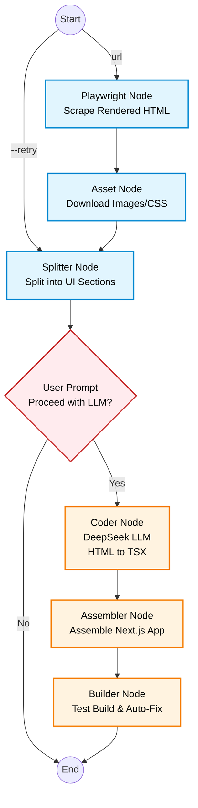

# Webpage Cloner

Webpage Cloner is a powerful tool built with LangGraph, Playwright, and DeepSeek to automatically scrape, split, and clone web pages into a fully functional Next.js application.

The pipeline is split into two phases:
1. **Phase 1: Scraping & Splitting (Free)**: Uses Playwright to render the page, extracts HTML and assets, and splits the page into logical sections.
2. **Phase 2: Coding & Assembly (Uses LLM API)**: Sends the sections to DeepSeek to convert the HTML/CSS into React/Next.js components, assembles them into a Next.js project, and auto-fixes any build errors.

## Methodology

The cloner uses a directed graph (powered by LangGraph) to orchestrate the pipeline. Here is the methodology flow:



## Features
- **Phase 1: Zero-Cost Scrape**: Scrape and split the UI without using expensive LLM calls. Review the sections and API cost estimate before proceeding.
- **Phase 2: LLM Component Generation**: Converts split HTML sections into Next.js (TSX) components using DeepSeek Reasoner & Chat models.
- **Auto-Fix Builder**: Attempts to build the Next.js project and feeds compilation errors back for automatic fixes.
- **Caching & Retry**: Built-in caching so you don't have to rescrape pages when retrying the LLM coding phase.

## Setup

1. Install Python dependencies using `uv` (recommended):
   ```bash
   uv sync
   # or
   uv pip install -r requirements.txt
   ```
2. Set your DeepSeek API Key in a `.env` file at the root of the project:
   ```env
   DEEPSEEK_API_KEY=your_api_key_here
   ```

## Usage

Run the main CLI script with a URL:
```bash
python cloner.py https://example.com
```

**Available Flags:**
- `--retry`: Skip scraping and reuse the cached HTML/split sections from the previous run.
- `--yes`: Skip the user confirmation prompt before Phase 2 starts (non-interactive mode).

### Output
- Scraped/Cached data is saved to the `./cloned-site/` directory.
- The generated Next.js project is saved to the `./nextjs-output/` directory.

### Serving the generated Next.js app
You can run the created Next.js app with:
```bash
cd nextjs-output
npm install
npm run dev
```

## Results & Cost Efficiency

The cloned Next.js app is **90% perfect** in replicating the original site's layout, design, and structure.

> **Cost Efficiency**: Generating this Next.js app from a static HTML site using the DeepSeek API cost **only $0.01**!

> **Note on Images**: The main current limitation is that the image name allocation from the assets folder is occasionally misplaced, which can lead to broken or incorrect images being displayed in the generated application.

*(Replace these placeholders with your actual screenshot images)*
- 
- 
